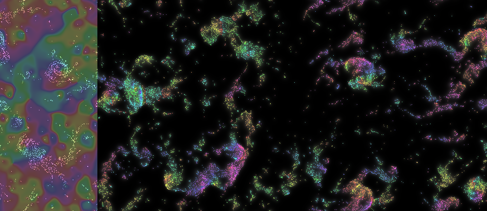

# soft boids

"softened" boids algrorithm that can run on a GPU.

> ### [Stigmergy](https://en.wikipedia.org/wiki/Stigmergy)
>
> A further key concept in the field of swarm intelligence is stigmergy. Stigmergy is a mechanism of indirect coordination between agents or actions. The principle is that the trace left in the environment by an action stimulates the performance of a next action, by the same or a different agent. In that way, subsequent actions tend to reinforce and build on each other, leading to the spontaneous emergence of coherent, apparently systematic activity. Stigmergy is a form of self-organization. It produces complex, seemingly intelligent structures, without need for any planning, control, or even direct communication between the agents. As such it supports efficient collaboration between extremely simple agents, who lack any memory, intelligence or even awareness of each other.

## bibliography:

code forked from https://github.com/nicoptere/physarum , a slime mold simulation !

which was an implmentation of sage jenson's [physarum](https://www.sagejenson.com/physarum)

## how to:

> `npm install`

> `npm run dev`

then build with

> `npm run deploy`

sample images:

